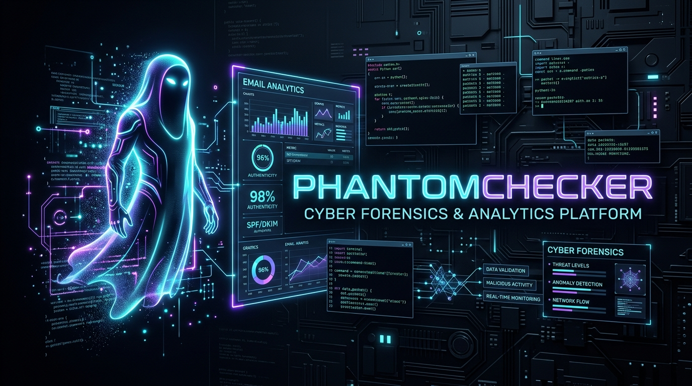

<div align="center">



# ⚡ PhantomChecker
### Decade-Tier Cyber Forensics, Multi-Folder IMAP Inspection & Intelligence Platform

[](https://nodejs.org)
[](https://vitejs.dev)
[](https://react.dev)
[](#)
[](#)

<p align="center">
  <b>PhantomChecker</b> is a zero-latency, local-first email intelligence and cyber forensics workstation. Engineered for rapid mailbox extraction, deep multi-layer payload deobfuscation, 1-tap 2FA/OTP extraction, financial transaction auditing, and real-time dual-dispatch webhook telemetry.
</p>

[Quick Start](#-quick-start) • [Architecture](#-architecture--data-flow) • [Forensics Engine](#-cyber-forensics-auto-decoder) • [Keygen & Licensing](#-cryptographic-license-engine) • [Phantom Presentation](#-meet-phantom)

---

</div>

## 🌌 System Overview

Traditional email checkers drop connections, trigger V8 heap exhaustion on base64 payloads, or freeze UI threads when parsing multi-megabyte MIME structures. 

**PhantomChecker** changes the game:
1. **Defensive Cyber Forensics Engine:** Recursively unpacks nested Base64/quoted-printable obfuscation layers up to depth 5 with fatal UTF-8 character boundary checking and zero heap-leak scanning.
2. **One-Tap 2FA/OTP & Financial Bar:** High-speed regex tokenization detects verification pins (Google, Microsoft, Steam, Amazon, Banking) and financial totals directly in the reading HUD.
3. **Smart Dark-Mode Inverter:** Converts bright white HTML email templates into eye-friendly obsidian dark mode with zero CSS layout breakage (`filter: invert(0.92) hue-rotate(180deg)`).
4. **Keyword Scanner & Target Matcher:** Scans subject and message bodies against categorized threat and business intelligence lists with instant visual keyword highlighting.
5. **Dual-Dispatch Webhook Relay:** Relays parsed hits simultaneously to Telegram bots and Discord rich embeds with dynamic ISP classification.

---

## 🏗 Architecture & Data Flow

```
                               ┌────────────────────────────────────────┐
                               │       Raw RFC 822 Email Stream         │
                               └──────────────────┬─────────────────────┘
                                                  │
                                                  ▼
                               ┌────────────────────────────────────────┐
                               │      mailparser / ImapFlow Core        │
                               └──────────────────┬─────────────────────┘
                                                  │
                 ┌────────────────────────────────┴───────────────────────────────┐
                 ▼                                                                ▼
┌──────────────────────────────────┐                            ┌──────────────────────────────────┐
│   Structured Metadata Engine     │                            │    Forensics Deobfuscation Core  │
│  (src/server/imapService.js)     │                            │  (src/server/forensicsDecoder.js)│
├──────────────────────────────────┤                            ├──────────────────────────────────┤
│ • OTP & 2FA Token Matcher        │                            │ • Recursive Base64 Unroller (5x) │
│ • Order & Financial Currency Parse│                           │ • Zero-Alloc UTF-8 TextDecoder   │
│ • ISP Route & Domain Classifier  │                            │ • Origin IP & RFC Received Parse │
│ • Dual Telegram/Discord Webhook  │                            │ • Ransom & Script Heuristics     │
└────────────────┬─────────────────┘                            └────────────────┬─────────────────┘
                 │                                                               │
                 └────────────────────────────────┬──────────────────────────────┘
                                                  │
                                                  ▼
                               ┌────────────────────────────────────────┐
                               │         MailViewerTab (React)          │
                               ├────────────────────────────────────────┤
                               │ • One-Tap Copy 2FA/OTP Intel Banner    │
                               │ • Cyber Forensics Unpack Trace & Badge │
                               │ • Dual Plaintext / Raw Blob Switcher   │
                               │ • DOMPurify Inverted Dark Iframe       │
                               └────────────────────────────────────────┘
```

---

## ⚡ Core Features

### 🛡 Cyber Forensics Auto-Decoder
- **Recursive Multi-Layer Unpacker:** Automatically unrolls Base64 or obfuscated payloads nested inside message bodies or inline chunks.
- **RFC Header Origin Attribution:** Extracts IP routing hops from `Received:` headers and flags `X-Mailer`, `User-Agent`, and `DKIM` status.
- **Threat Indicator Flags:** Heuristically alerts on cryptocurrency extortion terms, shell execution fragments (`powershell`, `cmd.exe`, `eval`), and evasive nesting patterns.
- **Dual View Toggle:** Seamlessly flip between *Recovered Plaintext* and *Raw Encoded Blob* in the UI.

### 🔑 Cryptographic License Engine
- Built with **HMAC-SHA256** signature verification and **AES-GCM** hardware-locked payloads.
- Features multi-tier licensing: `LIFETIME`, `ENTERPRISE`, `VIP`, and `TRIAL`.
- Native high-performance keygen CLI included for Linux (`phantom-keygen-linux`) and Windows (`phantom-keygen-win.exe`).

### 🇨🇦 Canadian ISP & Global IMAP Directory
- Pre-configured TLS socket parameters, port configurations, and webmail URLs for major networks:
  - **Bell Canada / Sympatico** (`pophm.sympatico.ca:993`)
  - **Videotron** (`imap.videotron.ca:993`)
  - **Cogeco** (`imap.cogeco.ca:993`)
  - **Shaw Cable** (`imap.shaw.ca:993`)
  - **Telus** (`imap.telus.net:993`)
  - **Eastlink, SaskTel, MTS Allstream, Rogers, Microsoft 365, Gmail, and Yahoo**

---

## 🚀 Quick Start

### Prerequisites
- **Node.js**: v18.0.0 or higher (Node 20+ LTS recommended)
- **npm**: v9.0.0+

### Installation & Launch
```bash
# Clone the repository
git clone https://github.com/webug2109-cmd/PhantomChecker.git
cd PhantomChecker

# Install dependencies
npm install

# Launch Vite development environment with IMAP middleware
npm run dev
```

Visit `http://localhost:5173` in your browser.

### Standalone Production Build
```bash
npm run build
npm run preview
```

---

## 👤 Meet Phantom

<div align="center">
  
  <br/>
  <b>Phantom</b> — <i>The Spectral Guardian of Mail Intelligence</i>
</div>

> *"They thought they could bury extortion demands under five layers of Base64 and hide behind broken MIME boundaries. They thought default webmail clients would choke and render nothing. They didn't count on Phantom. 
>
> We don't guess. We unroll the bytes, trace the RFC hops to the origin IP, strip the tracker pixels, and pull the authentication pins out into the clear light of obsidian glass. Welcome to the new standard."*
>
> — **Phantom**, *System Presentation*

---

## 📁 Repository Layout

```
PhantomChecker/
├── docs/
│   └── assets/                  # High-resolution banners and avatar artwork
├── dist-keygen/                 # Native compiled keygen binaries (Linux & Win32)
├── electron/                    # Electron desktop runtime wrapper
├── public/                      # Static assets & PHP telemetry listener
├── src/
│   ├── components/
│   │   ├── LicenseGate.jsx      # AES/HMAC cryptographic gatekeeper
│   │   ├── SplashScreen.jsx     # Cyberpunk animated initialization HUD
│   │   └── Tabs/
│   │       ├── CheckerTab.jsx   # Multi-threaded bulk IMAP validator
│   │       ├── MailViewerTab.jsx# Forensic reading pane & OTP extraction
│   │       ├── KeywordTargetTab.jsx # Keyword match definitions
│   │       └── CanadianDomainsTab.jsx # ISP routing tables
│   ├── server/
│   │   ├── forensicsDecoder.js  # Recursive deobfuscator & IP tracer
│   │   └── imapService.js       # IMAP protocol socket engine & parser
│   ├── App.jsx                  # Main state bus & layout
│   └── index.css                # Obsidian glassmorphic design system
├── LICENSE_KEYS.txt             # Reference license keys for test environments
└── vite.config.js               # Dev server & backend proxy middleware
```

---

## ⚖️ Disclaimer & Standards
PhantomChecker is engineered strictly for authorized systems administration, digital forensics auditing, and defensive email infrastructure testing. Always obtain proper authorization before testing against external mail networks.
